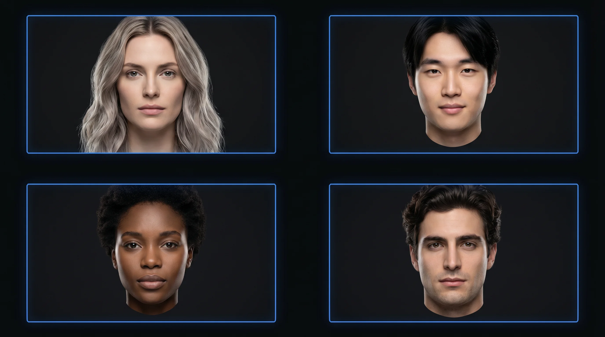

<p align="center">
  
  </br>
  <h3 align="center"><a href="https://on-model.com">Create Identity by PiktID</a></h3>
</p>

<p align="center">
  <b>Generate proprietary AI models from a brief or a reference image. No casting required.</b>
  <br/>

</p>

<p align="center">
  
</p>

# Create Identity - v1.0
[](https://on-model.com)
[](https://app.on-model.com)
[](https://discord.com/invite/FJU39e9Z4P)

Create Identity implementation by PiktID for generating brand-owned AI models. Describe the model you want, generate it in seconds, and promote it into your library as a permanent identity reusable in Model Swap and Flat-to-Model. Built on the <a href="https://v2.api.piktid.com">PiktID v2 API</a>.

## Why On-Model?

- **Brand-owned identities** — Generated identities are private to your account and yours forever. No model contracts, no licensing footnotes, no reshoots when a face is unavailable.
- **No casting fees** — McKinsey estimates traditional fashion photography costs $500–$1,000 per SKU, with talent driving a growing share of the bill. Skip it entirely.
- **Reusable across campaigns** — Once an identity is in your library, it works in every Model Swap or Flat-to-Model job exactly like an uploaded one.
- **Attribute-level control** — Structured fields (appearance, face, hair, outfit, style, scene, camera) or a free-form expert prompt for fine-grained art direction.
- **From-image extraction** — Pass a reference photo to auto-fill the brief from the subject's identity attributes. The reference is read, not copied; the output is a new person.

Built by PiktID — the team behind [Studio](https://studio.piktid.com) and EraseID, used by 300,000+ people for AI-powered image processing.

## About On-Model

[On-Model](https://on-model.com) is an AI-powered platform by PiktID designed for fashion e-commerce. It enables brands, retailers, and marketplaces to transform their product imagery at scale:

- **Model Swap** — Replace models in existing product photos while preserving garments exactly as they are
- **Flat-to-Model** — Convert flat-lay product photography into realistic on-model images
- **Identity Management** — Upload, **generate**, and maintain consistent AI model identities across your entire catalog

Try the platform at [app.on-model.com](https://app.on-model.com) — **15 free images per month**, no credit card required.

## Getting Started

The following instructions suppose you have already installed a recent version of Python (3.9+). For the full feature reference, please visit the <a href="https://docs.piktid.com/docs/v2/concepts/identities/create">Create Identity API documentation</a>.

> **Step 0** - Register at <a href="https://app.on-model.com">app.on-model.com</a>. 15 images are given for free to all new users every month. Then generate an API token from your [profile dashboard](https://app.on-model.com/profile?tab=tokens).

> **Step 1** - Clone the Create Identity repository
```bash
$ git clone https://github.com/piktid/create-identity.git
$ cd create-identity
$ pip install requests
```

> **Step 2** - Author your brief

A brief is a JSON file matching the body shape of `POST /identity/create`. The repository ships with two examples in `briefs/`:

- `briefs/scandinavian-model.json` — structured brief (`appearance`, `face`, `hair` groups)
- `briefs/expert-prompt.json` — free-form expert prompt for fine-grained art direction

Each instruction can use either structured fields or a free-form `prompt`. When `prompt` is set, it is sent verbatim and the structured fields are stored as metadata only.

The user-facing groups are:

| Group        | Sub-fields                                                                                       |
| ------------ | ------------------------------------------------------------------------------------------------ |
| `appearance` | `gender`, `age`, `ethnicity`, `skin`, `build`, `size`, `height`, `expression`                    |
| `face`       | `eyes`, `eyebrows`, `nose`, `lips`, `smile`, `face_shape`, `facial_hair`, `makeup`, `marks`      |
| `hair`       | `color`, `length`, `style`                                                                       |

Every field is optional. Leave one blank and the generator picks something sensible. Camera angle, framing, lighting, outfit, and background are standardized by the platform across every Create Identity job, so each identity in your library shares the same clean front-facing portrait treatment.

If you would rather start from a reference photo than write a brief by hand, skip to **Step 3** and use `--from-image` instead — the script uploads the reference, extracts identity attributes via the preset-extraction API, and submits automatically.

> **Step 3** - Generate drafts

From a brief:

```bash
$ python create_identity.py \
  --brief briefs/scandinavian-model.json \
  --token YOUR_API_TOKEN \
  --output-folder output
```

Or from a reference image (the script uploads it, runs preset extraction, and builds the brief automatically):

```bash
$ python create_identity.py \
  --from-image reference/reference_model.jpg \
  --token YOUR_API_TOKEN \
  --variations 4
```

In both cases the script submits the brief, polls for completion, and downloads every draft to `output/drafts/`. With `num_variations: 3` you get three faces; with `num_variations: 8` (the maximum) you get eight to choose from.

> **Step 4** - Pick a draft and promote it

By default the script prints the draft list and prompts you for a choice:

```
Available drafts:
  [0] image_result_id=12345  local=output/drafts/draft_12345.jpg
  [1] image_result_id=12346  local=output/drafts/draft_12346.jpg
  [2] image_result_id=12347  local=output/drafts/draft_12347.jpg

Pick a draft to promote (0-2, or 'q' to quit):
```

You can skip the picker:

```bash
# Auto-promote the first completed draft
$ python create_identity.py \
  --brief briefs/scandinavian-model.json \
  --token YOUR_API_TOKEN \
  --auto-promote

# Promote a specific draft by image_result_id
$ python create_identity.py \
  --brief briefs/scandinavian-model.json \
  --token YOUR_API_TOKEN \
  --pick 12346
```

Promotion charges 50 credits and counts toward your identity slot cap (50 per non-enterprise account). After promotion the script polls preprocessing until the new identity is ready.

> **Step 5** - Use your new identity

The promoted identity is in your library on [app.on-model.com](https://app.on-model.com), reusable in any Model Swap or Flat-to-Model job. The identity_code is printed at the end of the run and saved to `output/<identity_code>/metadata.json`.

To use it in a Model Swap job, see the [model-swap repo](https://github.com/piktid/model-swap). To use it in a Flat-to-Model job, see the [flat-to-model repo](https://github.com/piktid/flat-to-model).

## Output structure

```
output/
├── drafts/
│   ├── draft_12345.jpg          # Every completed draft
│   ├── draft_12346.jpg
│   └── draft_12347.jpg
└── abc1234567xy/                # New identity_code
    ├── draft_12346.jpg          # The chosen draft (also kept here for reference)
    └── metadata.json            # Provenance: brief + drafts + identity_code + job_ids
```

## API Flow

The script follows this sequence of API calls:

All requests are authenticated with a Bearer token (generated from your [profile dashboard](https://app.on-model.com/profile?tab=tokens)) in the `Authorization` header.

```
1. POST /upload                          -> (only with --from-image; uploads the reference)
2. POST /preset/extract-from-image       -> (only with --from-image; extracts a brief)
3. POST /identity/create                 -> Submit brief, get job_id
4. GET  /jobs/<id>/status                -> Poll until status = "completed"
5. GET  /jobs/<id>/results               -> Fetch draft image_result_ids + URLs
6. POST /identity/promote-generated      -> Promote chosen draft, get identity_code
7. GET  /identity/<code>/status          -> Poll until preprocessing_status = "completed"
```

Full reference at the [Create Identity docs](https://docs.piktid.com/docs/v2/concepts/identities/create).

## Generation models

By default On-Model picks the best engine for each job (`auto`). You can override the engine with the `--model` flag:

```bash
$ python create_identity.py \
  --brief briefs/scandinavian-model.json \
  --token YOUR_API_TOKEN \
  --model nano_banana_pro
```

`--model` overrides the engine for the run (including the brief's own `options.model`, if set). You can also set it directly in the brief's job-level options instead:

```jsonc
{
  "instructions": [...],
  "options": {"model": "nano_banana_pro"}
}
```

Accepted values: `auto`, `nano_banana_2`, `nano_banana_pro`, `seedream`, `orbita`. Note that `orbita` has tighter constraints — 1K output only, no reference images, and a reduced aspect-ratio set (no `4:5`, `5:4`, or `21:9`).

## Starting from a reference image

`--from-image` mirrors the **From Image** button in the Identities wizard on app.on-model.com. The script:

1. Uploads the reference via `POST /upload`
2. Runs `POST /preset/extract-from-image` with `type: "identity_creation"` to read identity attributes (gender, age range, skin tone, eyes, hair) from the photo
3. Wraps the extracted attributes in a brief and submits

The reference image itself is **not** passed to the generator — a new person is generated who matches the extracted attributes.

```bash
$ python create_identity.py \
  --from-image reference/reference_model.jpg \
  --token YOUR_API_TOKEN \
  --variations 4 \
  --auto-promote
```

Add `--save-brief briefs/extracted.json` to write the generated brief to disk so you can inspect it, edit it, or re-run with tweaks.

Preset extraction charges credits separately from the creation job (see [Pricing](https://app.on-model.com/pricing)). Need a hand-authored brief instead? Use `--brief` with a JSON file modeled on `briefs/scandinavian-model.json`.

### Advanced: input_assets in expert prompts

If you want the generator itself to riff on a visual reference (rather than read attributes from it), you can write an expert-prompt brief that includes `input_assets`. Upload the reference manually via `POST /upload`, put the resulting `file_id` in the brief, and pair it with a free-form `prompt`:

```jsonc
{
  "instructions": [
    {
      "prompt": "A model styled in the same vibe as the reference, ...",
      "input_assets": [{"file_id": "img_xyz..."}],
      "num_variations": 2,
      "options": {"ar": "3:4", "size": "2K", "format": "jpg"}
    }
  ],
  "options": {"model": "auto"}
}
```

`input_assets` is capped at 3 per instruction and is not supported when `model` is `orbita`.

## Command Line Options

```
--brief             Path to a brief JSON file (mutually exclusive with --from-image)
--from-image        Path to a reference image; the script uploads it, runs preset
                    extraction, and builds a brief automatically (mutually
                    exclusive with --brief)
--token             API token (required) — generate at https://app.on-model.com/profile?tab=tokens
--output-folder     Output folder for drafts and provenance (default: output)
--variations        Number of draft variations when using --from-image (default: 3, max: 8). Ignored with --brief.
--save-brief        When using --from-image, also save the generated brief JSON to this path.
--base-url          API base URL (default: https://v2.api.piktid.com)
--model             Generation engine: auto | nano_banana_2 | nano_banana_pro | seedream | orbita (default: auto). Overrides the brief's options.model.
--auto-promote      Skip the interactive picker and promote the first completed draft
--pick              Promote a specific draft by image_result_id (skips the picker)
--name              Optional explicit name for the promoted identity (otherwise the brief's job-level "name" is used and auto-suffixed on collision)
```

## Usage Examples

### Example 1: Structured brief

```bash
$ python create_identity.py \
  --brief briefs/scandinavian-model.json \
  --token YOUR_API_TOKEN
```

Submits the structured Scandinavian-model brief, prints draft list, prompts for pick.

### Example 2: Expert prompt, auto-promote

```bash
$ python create_identity.py \
  --brief briefs/expert-prompt.json \
  --token YOUR_API_TOKEN \
  --auto-promote \
  --name "Editorial campaign hero"
```

Sends the free-form prompt, promotes the first completed draft as `Editorial campaign hero`.

### Example 3: From a reference image

```bash
$ python create_identity.py \
  --from-image reference/reference_model.jpg \
  --token YOUR_API_TOKEN \
  --variations 4 \
  --save-brief briefs/extracted.json \
  --auto-promote
```

Uploads the reference, extracts identity attributes via preset extraction, generates 4 drafts, promotes the first, and saves the auto-generated brief to `briefs/extracted.json` for reuse.

## Batch Processing (Parallel)

For generating multiple identities at once, use `batch_create_identity.py`. It runs multiple `CreateIdentity` instances in parallel using a thread pool, with each worker handling a complete independent workflow. Batch mode always uses `--auto-promote`.

### Process every brief in a directory

```bash
$ python batch_create_identity.py \
  --briefs-dir briefs/ \
  --token YOUR_API_TOKEN \
  --output-dir output/
```

### Process specific briefs

```bash
$ python batch_create_identity.py \
  --briefs briefs/scandinavian-model.json briefs/expert-prompt.json \
  --token YOUR_API_TOKEN \
  --output-dir output/ \
  --parallel 3
```

### Batch Command Line Options

```
--briefs-dir        Directory containing brief JSON files (mutually exclusive with --briefs)
--briefs            Specific brief file paths to process (mutually exclusive with --briefs-dir)
--token             API token (required)
--output-dir        Base output directory (default: output). Each brief's output goes to <output-dir>/<brief-stem>/
--base-url          API base URL (default: https://v2.api.piktid.com)
--parallel          Number of parallel workers (default: 3, max: 5)
```

Parallelism is capped at 5 to respect the API rate limit (5 requests/minute on `/identity/create` and `/identity/promote-generated`). The built-in retry mechanism handles any 429 responses that occur when jobs are submitted close together.

A JSON summary file (`batch_summary.json`) is saved to the output directory after each run with timing and identity_code per brief.

## Rate Limiting and Resilience

The script includes built-in handling for API rate limits:

- **Rate limiting (429):** All API calls automatically retry with exponential backoff (1s, 2s, 4s, 8s, 16s) plus random jitter, up to 5 retries per request
- **Token expiry (401):** If your token has expired, the script will print an error. Generate a new token at [app.on-model.com/profile?tab=tokens](https://app.on-model.com/profile?tab=tokens).

The Create Identity endpoints are rate-limited to **5 requests per minute** each. Non-enterprise accounts also have a **5 concurrent jobs cap** (shared with Model Swap and Flat-to-Model) and a **50 identity slot cap**.

## Troubleshooting

### Insufficient credits
```
Failed to submit creation job: 402 ...
```
**Solution:** Generation costs scale with model, output size, and total variations. Promotion costs an additional 50 credits. Check your balance at [app.on-model.com](https://app.on-model.com) or via `GET /billing/credits`.

### Prompt blocked (real person)
```
Failed to submit creation job: 400 ... blocked term: '...'
```
**Solution:** The platform refuses prompts that depict specific real people. Rewrite the brief to describe a fictional person (mixed-heritage, similar styling, etc.) rather than naming a celebrity.

### Identity slot cap reached
```
Failed to promote draft: 429 ... Maximum identities reached.
```
**Solution:** Non-enterprise accounts can hold up to 50 identities. Delete an unused identity from your library on [app.on-model.com](https://app.on-model.com) or contact sales for an enterprise plan.

### Draft already promoted
```
Draft already promoted as identity abc1234567xy
```
This is informational. The script treats it as a successful promotion and proceeds to poll preprocessing on the existing identity_code.

### Rate limited
```
Rate limited (429). Waiting 2.1s before retry 1/5...
```
This is normal behavior. The script automatically retries with increasing delays. If you see "Max retries exceeded", wait a minute and try again.

### Job timeout
```
Timeout: job took longer than 900 seconds
```
**Solution:** The job may be taking longer than expected. Check your job list on [app.on-model.com](https://app.on-model.com). If the job is still processing, you can re-run with `--pick <image_result_id>` once it completes (look up the id via the app or `GET /jobs/<id>/results`).

## Error Handling

The script will exit with an error code if:
- Authentication fails
- The brief is missing or invalid
- Reference upload fails (when applicable)
- Job creation fails
- The job does not complete successfully
- Promotion fails for any reason other than "already promoted"
- Preprocessing fails or times out

Check the console output for detailed error messages.

## Links

- [On-Model Website](https://on-model.com) — Learn about the platform
- [On-Model App](https://app.on-model.com) — Try the app (15 free images/month)
- [Model Swap Repo](https://github.com/piktid/model-swap) — Replace models in product photos
- [Flat-to-Model Repo](https://github.com/piktid/flat-to-model) — Convert flat-lays into on-model shots
- [API Documentation](https://docs.piktid.com/docs/v2) — Full API reference
- [Create Identity Docs](https://docs.piktid.com/docs/v2/concepts/identities/create) — End-to-end walkthrough with Python examples
- [PiktID](https://piktid.com) — Company website
- [Discord](https://discord.com/invite/FJU39e9Z4P) — Community and support

## Contact
office@piktid.com
